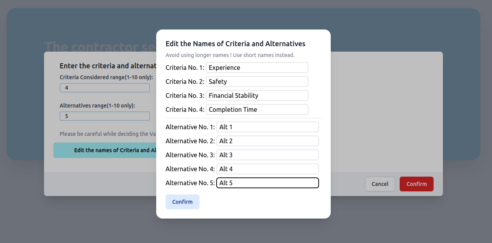
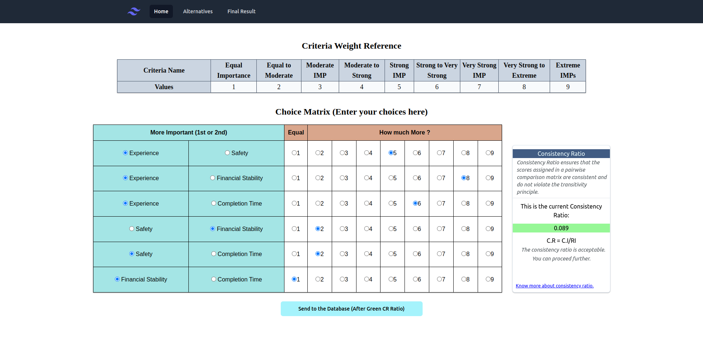
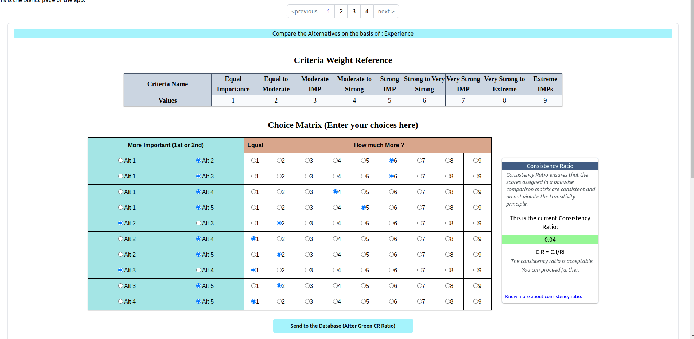
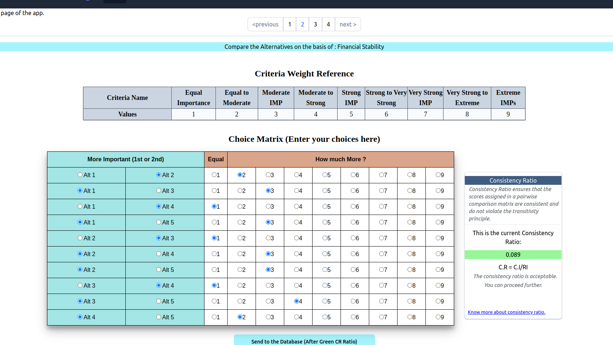
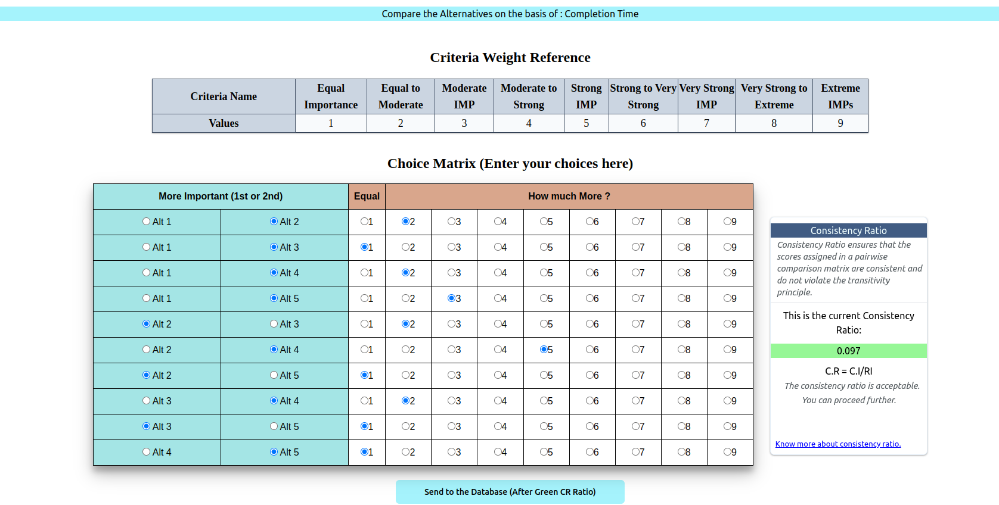
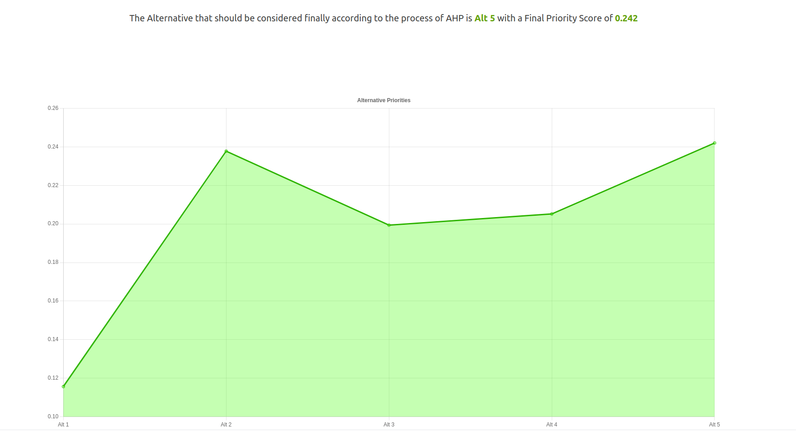
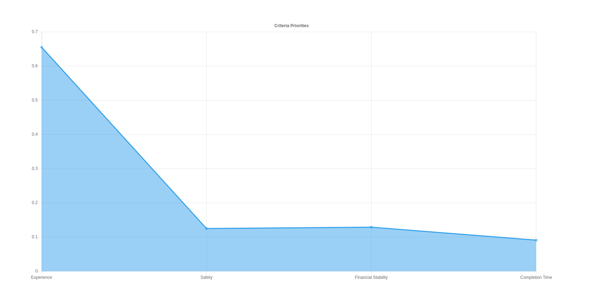

# Analytical-Hierarchial-Process Evaluator

## Problem Statement:

The 'In-General' methodology for assignment of a contract (usually by a Government body ) for any project (say construction, services) is using the lowest-bidding technique. The contractor who bids the lowest amount above some cap is usually preferred for the final approval. This may lead to biased or incorrect selection of a contractor, which may pose the risk of bad quality of final product delivered.  

The Analytical Hierarchy Process was developed by Thomas M. Saaty. This is a **Decision Making Model** that takes in range of inputs namely : Criteria and Alternatives. By using some mathematical calculations a prority vector is calculated for the Alternatives on the basis of criterias. This in return gives us a final most optimal Alternative to be selected.

## Using the Application

### Build of the Application.

1. (For FrontEnd) From the `*Main` branch:

   1. `git pull`  or download as zip.

   2. `npm install` for installing all the dependencies.
    

### Operating the Application:

1. Click on the ***Home*** Tab. Click ***Get Started*** .

2. This will open a Modal Box. For the sake of this example you may enter the Criteria as 4 and Alternative as 5.
   

3. After entering the Criteria and Alternative values click on `Edit the names of Criteria and Alternatives` . Enter the names of you choice. For now change all the names of all the Criterias and Alternatives ***compulsorily***. Hit `Confirm`. Again hit `Confirm`.

4. Enter the data such that the Consistency Ratio is Acceptable or Green.You may enter the data from the image below.After getting similar results hit `Send to the Database` ***Only once***.
   
   

5. Click on the `Alternatives` Tab. For the sake of this example you may enter the following data : 
 
   1. For pagination 1. After getting similar results hit `Send to the Database`.
   
      
  
   2. For pagination 2.After getting similar results hit `Send to the Database` .
       
      
      
   3. For pagination 3.After getting similar results hit `Send to the Database` .
     
      
  
   4. For pagination 4.After getting similar results hit `Send to the Database`.
   
      
  
 6. Click `Final Result` . And hit `Get the final Result`. You should be looking at something like:
 
      
      
      

 7. This project primarily use ReactJs as its main framework that enables this application to maintain its responsive and dynamic nature.
    
 9. For state management React - Redux is used as the main state management tool.
     
 11. For routing and URL management react-router is the primary liabrary used.
   
 12. The LocalStorage is used for pertsistance of the data like Criteria Names and Alternative Names.
     
     Also the Eigen vector Array is sent to the local storage in order to enhance cross browser compatibility.
     
 13. This repository is up for contributions. You may suggest new features and bug fixes.
